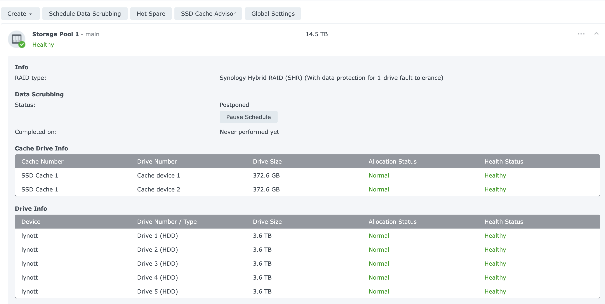
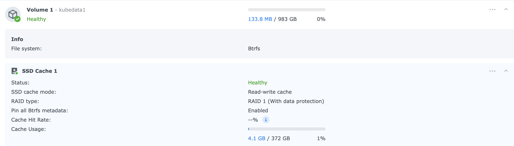
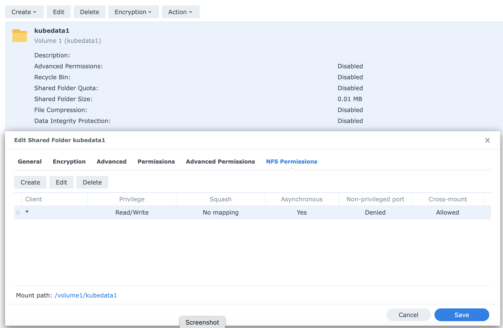
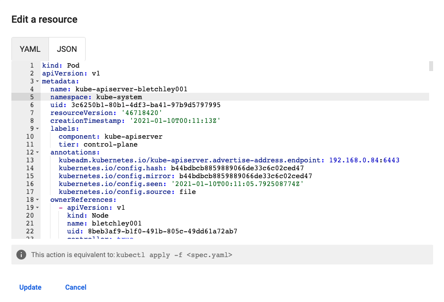

# home-kube-setup
Repo housing documentation and scripts related to setup and provisioning of my home kube cluster

# Initial Setup

## Pi SSH Setup
As a prerequisite to running ansible automation against hosts in the cluster, we first need to add ssh authorized users to each host. I've put relevant public keys that will be used as control nodes (e.g. my MacBook Pro and the bletchley001 pi) in my github account, and they can be accessed at: https://github.com/bpafoshizle.keys. Adding these keys to `~/.ssh/authorized_keys` on the managed node will allow ansible commands to be executed on the control node without having to worry about a username and password. The [00-get-ssh-authorized-users.sh](deploy/00-get-ssh-authorized-users.sh) script can be run on each managed node to add the ssh keys for control nodes as defined in my github keys. 

## Links and Tutorials Followed

Currently provisioning kube with flannel per the guide, but [calico looks like a better overall option](https://rancher.com/blog/2019/2019-03-21-comparing-kubernetes-cni-providers-flannel-calico-canal-and-weave/) that I want to look into. 

[Primary Kube on Pis Article](https://opensource.com/article/20/6/kubernetes-raspberry-pi)

[Ubuntu's Guide to installing on RPi](https://ubuntu.com/tutorials/how-to-install-ubuntu-on-your-raspberry-pi#4-boot-ubuntu-server)

[Ansible smoke test](https://www.digitalocean.com/community/tutorials/how-to-install-and-configure-ansible-on-ubuntu-20-04)

[Ansible inventory config docs](https://docs.ansible.com/ansible/latest/user_guide/intro_inventory.html#id8)

## Commands for setup

Command to test some variables:

```ansible-playbook -i ./ansible/inventory/hosts ./ansible/99-test.yml```

Command to check validity of main config: 

```ansible-playbook -i ./ansible/inventory/hosts ./ansible/01-kube.yml --check```

Command to run kube setup playbook:

```./deploy/01-run-kube-playbook.sh```

# Hardening

## Background

Hardening playbook uses a community galaxy role for [fail2ban](https://github.com/robertdebock/ansible-role-fail2ban), provided by robertdebock. To use, it must first be installed via the following run from the repo root:

## Preconfiguration Setup

```mkdir ./ansible/roles```

```ansible-galaxy install --roles-path ./ansible/roles robertdebock.fail2ban```


## Commands for hardening

Command to check validity of harden config: 

```ansible-playbook -i ./ansible/inventory/hosts ./ansible/02-harden.yml --check```

Command to run harden playbook:

```./deploy/02-run-harden-playbook.sh```

# Add additional hosts to cluster

Command to check validity of add local hosts config:

```ansible-playbook -i ./ansible/inventory/hosts ./ansible/03-add-local-hosts.yml --check```

Command for adding additional local hosts to each cluster host's `/etc/hosts` file:

```./deploy/03-run-add-local-hosts-playbook.sh```

# Install additional packages to all cluster hosts

Command to check the validity of installing packages:

```ansible-playbook -i ./ansible/inventory/hosts ./ansible/03-add-packages.yml --check```

Command to run playbook for installing packages:

```./deploy/03-run-add-packages-playbook.sh```

# Setting up Persistent Storage

## Useful Links
This person has almost my exact same setup. Kube running on pi4s with a synology NAS: [debontonline.com](https://www.debontonline.com/p/kubernetes.html)

## Preconfiguration Setup 
This setup involves mostly kubernetes config and kubectl only. The ansible additions are for adding the hostname of the NFS server, [lynott (inventor of the magnetic disk drive)](https://www.invent.org/inductees/john-joseph-lynott), to every cluster host hosts file, and for installing the nfs-common package from apt to every host.

[Persistent volumes, like nodes, are not scoped to any namespace, but persistent volume claims are](https://stackoverflow.com/questions/32316178/does-kubernetes-pv-recognize-namespace-when-created-queried-with-kubectl). My original plan was to create a persistent volume for the cluster, following [official kube examples](https://github.com/kubernetes/examples/tree/master/staging/volumes/nfs) but I have decided to use the [Kubernetes NFS Subdir External Provisioner](https://github.com/kubernetes-sigs/nfs-subdir-external-provisioner), after reading [this stack overflow thread](https://stackoverflow.com/questions/44204223/kubernetes-nfs-persistent-volumes-multiple-claims-on-same-volume-claim-stuck) and confirming my understanding of [the official documentation on persistent volumes](https://kubernetes.io/docs/concepts/storage/persistent-volumes/), which states:

> Once bound, PersistentVolumeClaim binds are exclusive, regardless of how they were bound. A PVC to PV binding is a one-to-one mapping, using a ClaimRef which is a bi-directional binding between the PersistentVolume and the PersistentVolumeClaim.

The [Kubernetes NFS Subdir External Provisioner](https://github.com/kubernetes-sigs/nfs-subdir-external-provisioner) uses dynamic provisioning with a default storage class to simplify volume provisioning by dynamically creating persistent volumes as directories on the existing NFS share when defining a persistent volume claim per application need. 

Prior to running these commands, I have done some preconfiguration steps. 

- I have preconfigured my synology NAS server (hostname: lynott) for a storage pool, volume, and shared NFS folder. 
    - NAS Storage Pool Config
      - 
    - NAS Volume Config
      - 
    - NAS Shared Folder and NFS Config
      - 
    - Note that NFS does not really do security based on username and password, but is [based on hosts/ip of the clients](https://unix.stackexchange.com/questions/341854/failed-to-pass-credentials-to-nfs-mount). We have configured to allow all hosts. According to [this Synology documentation](https://kb.synology.com/en-global/DSM/help/DSM/AdminCenter/file_share_privilege_nfs?version=7), with the sys (AUTH_SYS) security option, "The client must have exactly the same numerical UID (user identifier) and GID (group identifier) on the NFS client and Synology NAS, or else the client will be assigned the permissions of others when accessing the shared folder. To avoid any permissions conflicts, you can select Map all users to admin from Squash or give "Everyone" permissions to the shared folder." So since all my kube services are running as root, and root is standard UID and GID 0 on linux, the mapping should work fine. This was confusing, because on my MacBook, where I am not root, I have to log in to the NAS with a preconfigured user to have permission. 
- I have also configured an IP address reservation of the NAS to its MAC address in my router to ensure the IP of the NAS is fixed. 
- I have a running kubernetes cluster as configured from the previous steps using Ansible.
- I have run the ansible playbooks above to add additional hosts (including the NFS host) and install additional packages (including nfs-common) to the cluster.
- I have forked the [nfs-subdir-external-provisioner](https://github.com/bpafoshizle/nfs-subdir-external-provisioner) repo and pulled the forked repo in as a [subtree](https://www.atlassian.com/git/tutorials/git-subtree) for editing.

## NFS Kube Service Setup
Change to the nfs-subdir-external-provisioner folder/repo: 

```cd kube/nfs-subdir-external-provisioner```

Modify the namespace (or leave it as default, which is what this did in my case) per the README:

```bash
NS=$(kubectl config get-contexts|grep -e "^\*" |awk '{print $5}')
NAMESPACE=${NS:-default}
sed -i '' "s/namespace:.*/namespace: $NAMESPACE/g" ./deploy/rbac.yaml ./deploy/deployment.yaml
```

Modify the `NFS_SERVER` and `NFS_PATH` env values and the nfs volume server and path properties in the [deployment.yaml](kube/nfs-subdir-external-provisioner/deploy/deployment.yaml) 

Run the kubectl commands to deploy the rbac components, the provisioner deployment, and the storage class (encapsulated in [kube/nfs-subdir-external-provisioner/deploy.sh](kube/nfs-subdir-external-provisioner/deploy.sh))

```bash
kubectl apply -f deploy/rbac.yaml
kubectl apply -f deploy/deployment.yaml
kubectl apply -f deploy/class.yaml
```

# Setting up Cluster Monitoring
I'm initially going to go with [Kubernetes Dashboard](https://github.com/kubernetes/dashboard). 

```bash
mkdir kube/kubernetes-dashboard && cd kube/kubernetes-dashboard && wget https://raw.githubusercontent.com/kubernetes/dashboard/v2.4.0/aio/deploy/recommended.yaml
kubectl apply -f recommended.yaml
```

Without admin, you can't do much with the dashboard. To grant the kubernetes-dashboard service account, run: 

```kubectl delete clusterrolebinding/kubernetes-dashboard && kubectl apply -f dashboard-admin.yaml```

To find the name of your kubernetes-dashboard service account token secret, run:

```kubectl -n kubernetes-dashboard get secrets```

To get the bearer token of the kubernetes-dashboard service account to be used to log in to the dashboard UI, run:

```kubectl -n kubernetes-dashboard get secret kubernetes-dashboard-token-kfl8c -o jsonpath='{.data.token}' | base64 --decode```

To start the proxy, run:

```kubectl proxy```

Then navigate to: 
http://localhost:8001/api/v1/namespaces/kubernetes-dashboard/services/https:kubernetes-dashboard:/proxy/

## Metrics
By default, while you can see tons of info with Kubernetes Dashboard, you cannot see the CPU and memory usage of individual pods and resources running in the cluster. To enable that, you need to install [metrics-server](https://github.com/kubernetes-sigs/metrics-server), which can be done like so:

```mkdir kube/metrics-server && cd kube/metrics-server && wget https://github.com/kubernetes-sigs/metrics-server/releases/latest/download/components.yaml```

```kubectl apply -f components.yaml```

Metrics Server needs [aggregator routing to be enabled](https://github.com/kubernetes-sigs/metrics-server/issues/448). While this could be accomplished via the Kubernetes Dashboard GUI, it's better to do via Ansible playbook, so I've added a step which can be run as a tagged task in a playbook.



Command to check and add the flag permanently to `/etc/kubernetes/manifests/kube-apiserver.yaml `: 

```ansible-playbook -i ./ansible/inventory/hosts ./ansible/01-kube.yml --tags kube-apiserver-enable-aggregator --check```

# Media Setup with Plex, Transmission, Radarr, Sonarr, etc
I'm following [this tutorial](https://greg.jeanmart.me/2020/04/13/self-host-your-media-center-on-kubernetes-wi/) roughly, adapting it to use my dynamic NFS subdir external provisioning deployment. I'll also be needing to work with Helm for the first time to follow this guide, so that needs to be installed on my Mac, which is accomplished via `brew install helm`. Follow this by adding the stable helm repo: `helm repo add stable https://charts.helm.sh/stable`.

## Cluster Components Setup

### MetalLB

First I need to install MetalLB. According to the guide I'm following: 

> When configuring a Kubernetes service of type LoadBalancer, MetalLB will dedicate a virtual IP from an address-pool to be used as load balancer for an application.

Installing MetalLB from helm stable as the guide says no longer works. It seems helm now hosts on github instead of Dockerhub, likely due to Docker making everything paid and more locked down the last couple years. So I had to add the new helm the metallb repo: `helm repo add metallb https://metallb.github.io/metallb` and updating: `helm repo update`. I also had to change how to supply the config for MetalLB, since with the newest MetalLb version, it wants a values yaml file and no longer supports the `configInline`. ChatGPT helped me out quickly here and also helpfully explained:

> The configInline field is a deprecated way to configure MetalLB using a YAML configuration block embedded in a Helm value file. The current recommended way to configure MetalLB with Helm is to use the values.yaml file to specify your configuration.

To install, you need to be in the deploy directory `source ../kube/metallb-nginx-certmanager/00-install-metallb.sh` and run or I've combined the install for metallb, nginx, and cert manager all into `05-00-deploy-metallb-nginx-certmanager.sh`

You should see: 

```
NAME: metallb
LAST DEPLOYED: Sun Apr 23 12:49:44 2023
NAMESPACE: kube-system
STATUS: deployed
REVISION: 1
TEST SUITE: None
NOTES:
MetalLB is now running in the cluster.
```

And you can check the pods with some slight alterations from the guide script: 

`kubectl get pods -n kube-system -l app.kubernetes.io/name=metallb -o wide`

Should yield the following:

```
NAME                                  READY   STATUS    RESTARTS   AGE     IP             NODE           NOMINATED NODE   READINESS GATES
metallb-controller-5b77564b5d-d7rbj   1/1     Running   1          4m29s   10.244.1.68    bletchley004   <none>           <none>
metallb-speaker-7mncc                 1/1     Running   0          4m29s   192.168.0.81   bletchley004   <none>           <none>
metallb-speaker-hxmt7                 1/1     Running   0          4m29s   192.168.0.80   bletchley005   <none>           <none>
metallb-speaker-mtddz                 1/1     Running   0          4m29s   192.168.0.82   bletchley003   <none>           <none>
metallb-speaker-wst7m                 1/1     Running   0          4m29s   192.168.0.84   bletchley001   <none>           <none>
metallb-speaker-xnwcr                 1/1     Running   0          4m29s   192.168.0.83   bletchley002   <none>           <none>
```

Interestingly to me is there is a listener pod running on each node with an IP already configured to be the externally reachable IP of each host on my internal LAN. Pretty cool.

### Nginx

Now I can install nginx ingress controller which will get an IP from MetalLB. Similarly to metallb, I had to change the repo for nginx to point to github, as the one for helm stable used by the guide was deprecated. You can install nginx to the cluster by running the following: `source ../kube/metallb-nginx-certmanager/01-install-nginx.sh`, or the `05-00-deploy-metallb-nginx-certmanager.sh` has it combined with metallb and cert manager. The output should look something like the below. 

```
"ingress-nginx" has been added to your repositories
Hang tight while we grab the latest from your chart repositories...
...Successfully got an update from the "metallb" chart repository
...Successfully got an update from the "ingress-nginx" chart repository
...Successfully got an update from the "stable" chart repository
Update Complete. ⎈Happy Helming!⎈
NAME: nginx-ingress
LAST DEPLOYED: Sun Apr 23 15:39:16 2023
NAMESPACE: kube-system
STATUS: deployed
REVISION: 1
TEST SUITE: None
NOTES:
The ingress-nginx controller has been installed.
It may take a few minutes for the LoadBalancer IP to be available.
You can watch the status by running 'kubectl --namespace kube-system get services -o wide -w nginx-ingress-ingress-nginx-controller'

An example Ingress that makes use of the controller:
  apiVersion: networking.k8s.io/v1
  kind: Ingress
  metadata:
    name: example
    namespace: foo
  spec:
    ingressClassName: nginx
    rules:
      - host: www.example.com
        http:
          paths:
            - pathType: Prefix
              backend:
                service:
                  name: exampleService
                  port:
                    number: 80
              path: /
    # This section is only required if TLS is to be enabled for the Ingress
    tls:
      - hosts:
        - www.example.com
        secretName: example-tls

If TLS is enabled for the Ingress, a Secret containing the certificate and key must also be provided:

  apiVersion: v1
  kind: Secret
  metadata:
    name: example-tls
    namespace: foo
  data:
    tls.crt: <base64 encoded cert>
    tls.key: <base64 encoded key>
  type: kubernetes.io/tls
```

You can check the nginx pod with `kubectl get pods -n kube-system -l app.kubernetes.io/name=ingress-nginx -o wide` and using `kubectl get services  -n kube-system -l app.kubernetes.io/name=ingress-nginx -o wide` from the guide:

>Interestingly, Nginx service is deployed in LoadBalancer mode, you can observe MetalLB allocates a virtual IP (column EXTERNAL-IP) to Nginx.


## Media Components Setup

For starters, I'm skipping creating the Persistent Volume, since mine will be dynimically provisioned, and I'm modifying the storage class like so: `storageClassName: managed-nfs-storage`.


# One Off Commands
Command to run test playbook:

```./ansible/99-run-test-playbook.sh```

Command to ping all hosts:

```./ansible/99-ping-test.sh```

Command to reboot all hosts:

```./ansible/99-reboot-all.sh```

Command to update all hosts:

```ansible-playbook -i ./ansible/inventory/hosts ./ansible/99-update.yml```

Command to prune docker system on all hosts:

```ansible-playbook -i ./ansible/inventory/hosts ./ansible/99-docker-prune.yml```

Command to check all CPU temperatures (in millidegrees Celsius):

```ansible -i ./ansible/inventory/hosts -u ubuntu --become all -m shell -a "cat /sys/class/thermal/thermal_zone*/temp"```

Command to check disck usage on all hosts:

```ansible -i ./ansible/inventory/hosts -u ubuntu --become all -m shell -a "df -h | grep /dev/mmcblk0p2"```

Command to check apiserver certificate expiration

```ansible -i ./ansible/inventory/hosts -u ubuntu --become kubecontrol -m shell -a "openssl x509 -in /etc/kubernetes/pki/apiserver.crt -noout -text |grep ' Not '"```

Command to check all cert expirations

```ansible -i ./ansible/inventory/hosts -u ubuntu --become kubecontrol -m shell -a "find /etc/kubernetes/pki/ -type f -name '*.crt' -print|egrep -v 'ca.crt$'|xargs -L 1 -t  -i bash -c 'openssl x509  -noout -text -in {}|grep After'"```

Kubeadm way to check cert expiration

```ansible -i ./ansible/inventory/hosts -u ubuntu --become kubecontrol -m shell -a "kubeadm certs check-expiration"```

Command to renew all kube certificates:
```ansible-playbook -i ./ansible/inventory/hosts ./ansible/99-renew-kube-certs.yml```

Command to update packages.cloud.google.com public key:
- I needed this 2022-12-27 when attempting to update OS packages and getting the error: 
  - `Err:1 https://packages.cloud.google.com/apt kubernetes-xenial InRelease The following signatures couldn't be verified because the public key is not available: NO_PUBKEY B53DC80D13EDEF05 NO_PUBKEY FEEA9169307EA071`
- ```ansible -i ./ansible/inventory/hosts -u ubuntu --become all -m shell -a "curl -s https://packages.cloud.google.com/apt/doc/apt-key.gpg | apt-key add -"```

