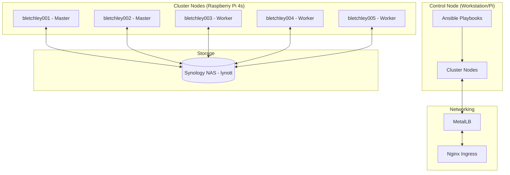

# home-kube-setup

A comprehensive repository for the automated setup, provisioning, and maintenance of a home Kubernetes cluster, primarily optimized for Raspberry Pi nodes running Ubuntu.

## Project Overview

This project automates the lifecycle of a high-availability (HA) home lab cluster, from initial bare-metal provisioning to hosting a production-grade media consumption stack.



## Infrastructure Stack

- **Compute**: Raspberry Pi 4 cluster (8GB models).
- **OS**: Ubuntu LTS (currently tracking 22.04).
- **Orchestration**: Kubernetes (kubeadm-based).
- **Networking**:
  - **CNI**: Flannel.
  - **Load Balancer**: MetalLB (Layer 2 mode).
  - **Ingress**: Nginx Ingress Controller.
- **Storage**: Synology NAS via NFS (dynamic provisioning using `nfs-subdir-external-provisioner`).
- **Provisioning**: Ansible.

## Documentation Navigator

Detailed technical guides and historical maintenance logs have been migrated to the `docs/` directory for better readability.

| Document | Description |
| :--- | :--- |
| 🛠️ [**Maintenance & Ops**](docs/kube/MAINTENANCE.md) | Initial setup, Ansible commands, persistence (NFS), and daily operations. |
| 📈 [**Upgrade Log**](docs/kube/UPGRADE_LOG.md) | Kubernetes version history (1.20 → 1.32), OS migrations, and troubleshooting. |
| 📺 [**Media Stack**](docs/kube/MEDIA_STACK.md) | Plex, Transmission, and the "Arr" suite deployment via Helm. |
| 🤖 [**OpenClaw**](docs/kube/OPENCLAW.md) | AI assistant deployment — two instances (Neumann + Anton) via Helm. |

## Quick Start

### Prerequisites
1. Ensure your nodes are reachable via SSH.
2. Update the Ansible inventory in `ansible/inventory/hosts`.

### Core Commands
- **Run Setup**: `./deploy/01-run-kube-playbook.sh`
- **Check Cluster Health**: `kubectl get nodes -o wide`
- **Dashboard Access**: `source deploy/04-01-deploy-kubernetes-dashboard.sh`

---

## Directory Structure

```text
.
├── ansible/          # Playbooks and roles for cluster automation
├── deploy/           # Execution scripts for recurring tasks
├── docs/             # Technical documentation and supporting images
├── kube/             # Kube manifest files and Helm configurations
└── sensitive/        # Local secrets (gitignored)
```