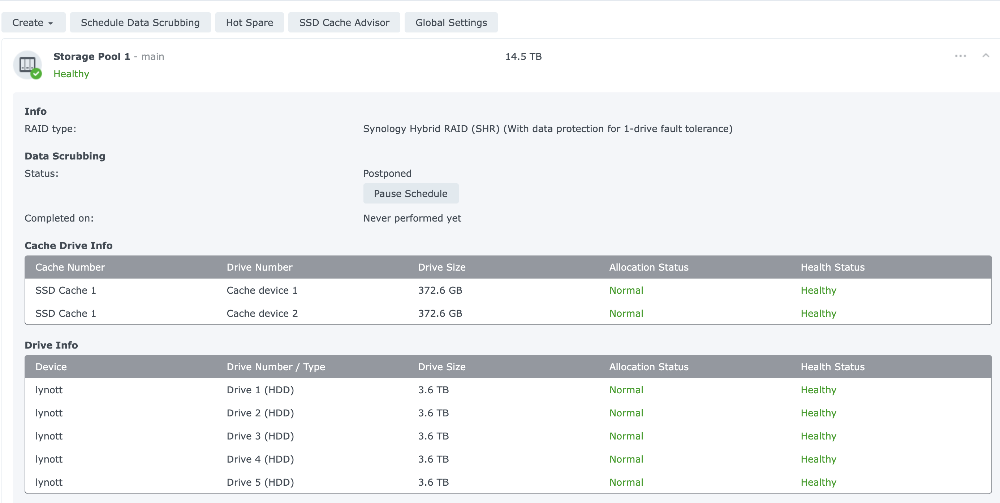
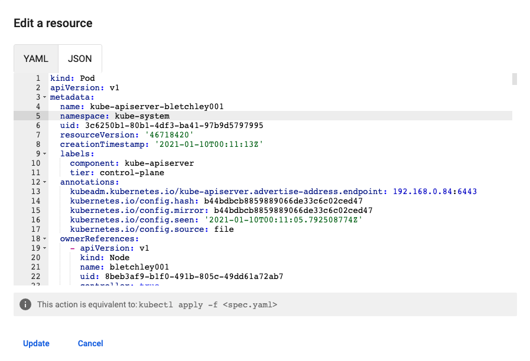

# Cluster Maintenance and Operations

This document contains detailed information on the initial setup, routine maintenance, and hardening of the home Kubernetes cluster.

## Initial Setup

### Pi SSH Setup
As a prerequisite to running ansible automation against hosts in the cluster, we first need to add ssh authorized users to each host. Relevant public keys are stored in my github account at: https://github.com/bpafoshizle.keys. Adding these keys to `~/.ssh/authorized_keys` on the managed node allows ansible commands to be executed on the control node without username and password prompts.

The [00-get-ssh-authorized-users.sh](../deploy/00-get-ssh-authorized-users.sh) script can be run on each managed node to add the ssh keys for control nodes.

### Links and Tutorials Followed
- [Primary Kube on Pis Article](https://opensource.com/article/20/6/kubernetes-raspberry-pi)
- [Ubuntu's Guide to installing on RPi](https://ubuntu.com/tutorials/how-to-install-ubuntu-on-your-raspberry-pi#4-boot-ubuntu-server)
- [Ansible smoke test](https://www.digitalocean.com/community/tutorials/how-to-install-and-configure-ansible-on-ubuntu-20-04)
- [Ansible inventory config docs](https://docs.ansible.com/ansible/latest/user_guide/intro_inventory.html#id8)

## Commands for setup

Command to test some variables:
```bash
ansible-playbook -i ./ansible/inventory/hosts ./ansible/99-test.yml
```

Command to check validity of main config: 
```bash
ansible-playbook -i ./ansible/inventory/hosts ./ansible/01-kube.yml --check
```

Command to run kube setup playbook:
```bash
./deploy/01-run-kube-playbook.sh
```

---

## Hardening

### Background
Hardening playbook uses a community galaxy role for [fail2ban](https://github.com/robertdebock/ansible-role-fail2ban). To use:

```bash
mkdir ./ansible/roles
ansible-galaxy install --roles-path ./ansible/roles robertdebock.fail2ban
```

### Commands for hardening
Check validity: 
```bash
ansible-playbook -i ./ansible/inventory/hosts ./ansible/02-harden.yml --check
```

Run hardening:
```bash
./deploy/02-run-harden-playbook.sh
```

---

## Setting up Persistent Storage (NFS)

The cluster uses [Kubernetes NFS Subdir External Provisioner](https://github.com/kubernetes-sigs/nfs-subdir-external-provisioner) for dynamic provisioning via a Synology NAS (hostname: `lynott`).

### Preconfiguration
1. **NAS Setup**: Configured storage pool, volume, and shared NFS folder.
   - 
   - 
   - 
2. **NFS Security**: Configured to allow cluster hosts. Root mapping (`no_root_squash` or `map all users to admin`) is generally required since kube services run as root.
3. **Static IP**: Reserved NAS IP in router.

### Deployment
```bash
cd kube/nfs-subdir-external-provisioner
kubectl apply -f deploy/rbac.yaml
kubectl apply -f deploy/deployment.yaml
kubectl apply -f deploy/class.yaml
```

---

## Cluster Monitoring

### Kubernetes Dashboard
Deploy the dashboard:
```bash
cd deploy && source 04-01-deploy-kubernetes-dashboard.sh 
```

To get the bearer token for the `admin-user` service account:
```bash
kubectl get secret admin-user -n kubernetes-dashboard -o jsonpath={".data.token"} | base64 -d
```

Access via port-forward:
```bash
kubectl -n kubernetes-dashboard port-forward svc/kubernetes-dashboard-kong-proxy 8443:443
```
Then navigate to: https://localhost:8443/

### Metrics Server
Metrics server enables Resource (CPU/Memory) usage viewing in the dashboard.
```bash
kubectl apply -f kube/metrics-server/components.yaml
```

Note: Needs aggregator routing enabled in `kube-apiserver`.


```bash
ansible-playbook -i ./ansible/inventory/hosts ./ansible/01-kube.yml --tags kube-apiserver-enable-aggregator --check
```

---

## Common Maintenance Commands

### Health & Monitoring
Check CPU temps:
```bash
ansible -i ./ansible/inventory/hosts -u ubuntu --become all -m shell -a "cat /sys/class/thermal/thermal_zone*/temp"
```

Check disk usage:
```bash
ansible -i ./ansible/inventory/hosts -u ubuntu --become all -m shell -a "df -h | grep /dev/mmcblk0p2"
```

### Certificates
Check Kubernetes certificate expiration:
```bash
ansible -i ./ansible/inventory/hosts -u ubuntu --become kubecontrol -m shell -a "kubeadm certs check-expiration"
```

Renew certificates:
```bash
ansible-playbook -i ./ansible/inventory/hosts ./ansible/99-renew-kube-certs.yml
```

### Cluster Operations
Reboot all hosts:
```bash
./deploy/99-reboot-all.sh
```

Shutdown all hosts:
```bash
ansible -i ./ansible/inventory/hosts all -m command -a "shutdown -h now" -u ubuntu --become
```

Update system packages:
```bash
ansible-playbook -i ./ansible/inventory/hosts ./ansible/99-update.yml
```
