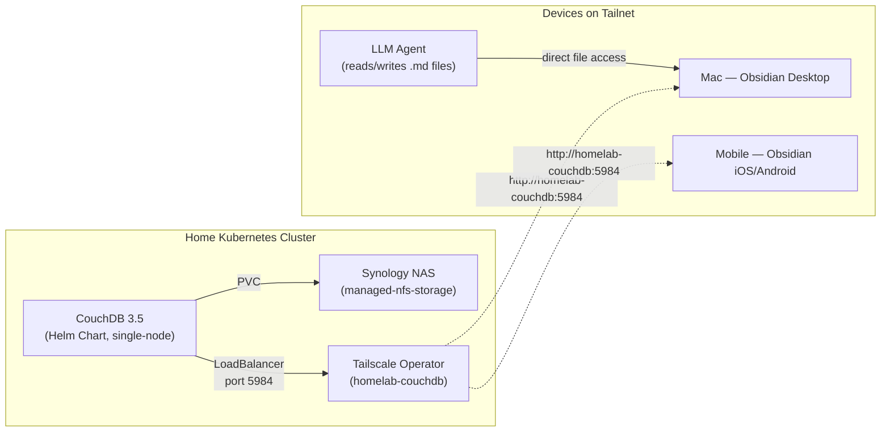

# Obsidian LiveSync — Self-Hosted Vault Sync

Self-hosted Obsidian vault synchronization using CouchDB and the [Self-hosted LiveSync](https://github.com/vrtmrz/obsidian-livesync) plugin. Provides real-time, conflict-free sync across all devices (desktop, mobile) via the Tailscale tailnet.

## Architecture



**Key components:**
- **CouchDB** — The sync backend. Deployed via the [official Apache Helm chart](https://github.com/apache/couchdb-helm) as a single-node instance.
- **Obsidian LiveSync plugin** — Installed in Obsidian on each device. Handles real-time bidirectional sync with CouchDB.
- **Tailscale** — All devices access CouchDB via the tailnet hostname `homelab-couchdb`. No public internet exposure.
- **NFS on Synology** — Persistent storage for CouchDB data.

## Deployment

### Prerequisites

- `kubectl` configured for the home cluster
- `helm` v3 installed
- Environment variables for CouchDB credentials

### Step 1: Create the Namespace

```bash
kubectl apply -f kube/couchdb/couchdb-namespace.yaml
```

### Step 2: Create the Secret

```bash
export COUCHDB_USER="admin"
export COUCHDB_PASSWORD="your-secure-password-here"
export COUCHDB_COOKIE_AUTH_SECRET="$(openssl rand -hex 32)"
export COUCHDB_ERLANG_COOKIE="$(openssl rand -hex 32)"
envsubst < kube/couchdb/couchdb-secret.yaml | kubectl apply -f -
```

> **Tip**: Save the `COUCHDB_COOKIE_AUTH_SECRET` and `COUCHDB_ERLANG_COOKIE` values somewhere safe (e.g., in `sensitive/`). You'll need them if you ever re-create the secret.

### Step 3: Deploy CouchDB via Helm

```bash
bash kube/couchdb/helm-deploy.sh
```

This will:
1. Add the `couchdb` Helm repo
2. Install/upgrade the CouchDB chart with LiveSync-compatible configuration
3. Expose the service as `homelab-couchdb` on the tailnet

### Step 4: Initialise for LiveSync

Wait for the CouchDB pod to be ready, then run the init Job:

```bash
kubectl get pods -n couchdb -w   # Wait for Running + 1/1 Ready
kubectl apply -f kube/couchdb/couchdb-init-job.yaml
kubectl logs -n couchdb job/couchdb-livesync-init -f
```

This configures single-node mode and creates the `obsidian` database.

### Step 5: Verify

```bash
# Check pod status
kubectl get pods -n couchdb

# Check service (should have a Tailscale external IP)
kubectl get svc -n couchdb

# Test from a tailnet device
curl http://homelab-couchdb:5984/
# Should return: {"couchdb":"Welcome", ...}

# Verify the database exists
curl http://homelab-couchdb:5984/obsidian -u admin:your-password
```

## Client Setup (Obsidian LiveSync)

### First Device

1. Install [Obsidian](https://obsidian.md/) and create/open your vault
2. Go to **Settings → Community plugins → Browse**
3. Search for **"Self-hosted LiveSync"** and install + enable it
4. Go to **Settings → Self-hosted LiveSync → Setup → Minimal setup**
5. Configure the connection:
   - **Remote Type**: CouchDB
   - **Server URI**: `http://homelab-couchdb:5984`
   - **Username**: your CouchDB admin username
   - **Password**: your CouchDB admin password
   - **Database name**: `obsidian`
6. Click **Test Connection** — should succeed
7. Click **Check and Fix** on any database configuration warnings
8. **Optional but recommended**: Enable **End-to-End Encryption** with a passphrase
9. Choose your sync method (LiveSync recommended for real-time)
10. After setup, **copy the Setup URI** for additional devices:
    - Settings → Self-hosted LiveSync → Setup → **Copy setup URI**
    - Enter a passphrase (different from E2EE passphrase)
    - Save the URI and passphrase securely

### Additional Devices

1. Install Obsidian and the Self-hosted LiveSync plugin
2. Go to **Settings → Self-hosted LiveSync → Setup**
3. Click **Use the copied setup URI**
4. Paste the Setup URI and enter the passphrase
5. Choose **"Set it up as secondary or subsequent device"**
6. Sync will begin automatically

### Mobile Notes

- For **iOS/Android**, the same process applies — install Obsidian from the app store, enable LiveSync, and use the Setup URI
- Mobile Obsidian may require HTTPS. If sync fails on mobile, you may need to enable [Tailscale HTTPS](https://tailscale.com/kb/1153/enabling-https) for MagicDNS

## LLM Wiki Pattern (Karpathy)

This setup is designed to support the [LLM Wiki pattern](https://gist.github.com/karpathy/442a6bf555914893e9891c11519de94f) described by Andrej Karpathy. The idea:

1. **Raw sources** — articles, papers, notes you collect (immutable)
2. **The wiki** — LLM-generated markdown files with summaries, entity pages, cross-references
3. **The schema** — an `AGENTS.md` / `CLAUDE.md` file that tells the LLM how to maintain the wiki

**Workflow**: Open Obsidian on one side, your LLM agent on the other. The agent reads/writes to the vault directory while you browse the results in Obsidian. LiveSync ensures all changes appear in real-time across devices.

**Useful Obsidian plugins for this pattern:**
- **Dataview** — query page frontmatter with SQL-like syntax
- **Graph View** (built-in) — visualize connections between pages
- **Marp** — generate slide decks from markdown
- **Web Clipper** — convert web articles to markdown for ingestion

## Troubleshooting

### CouchDB pod not starting
```bash
kubectl describe pod -n couchdb -l app=couchdb
kubectl logs -n couchdb -l app=couchdb
```

### Init job failing
```bash
# Delete and re-run
kubectl delete job couchdb-livesync-init -n couchdb --ignore-not-found
kubectl apply -f kube/couchdb/couchdb-init-job.yaml
kubectl logs -n couchdb job/couchdb-livesync-init -f
```

### LiveSync connection failing
1. Verify CouchDB is accessible: `curl http://homelab-couchdb:5984/`
2. Check CORS origins: `curl http://homelab-couchdb:5984/_node/_local/_config/cors/origins -u admin:password`
3. Verify database exists: `curl http://homelab-couchdb:5984/obsidian -u admin:password`
4. Use the **"Check and Fix"** button in LiveSync settings to auto-repair configuration issues

### Upgrading CouchDB
```bash
helm repo update
bash kube/couchdb/helm-deploy.sh
```

## File Reference

| File | Purpose |
|:--|:--|
| `kube/couchdb/couchdb-namespace.yaml` | Namespace definition |
| `kube/couchdb/couchdb-secret.yaml` | Admin credentials (envsubst template) |
| `kube/couchdb/values.yaml` | Helm chart values (LiveSync config) |
| `kube/couchdb/helm-deploy.sh` | Helm install/upgrade script |
| `kube/couchdb/couchdb-init-job.yaml` | One-time LiveSync initialisation job |
